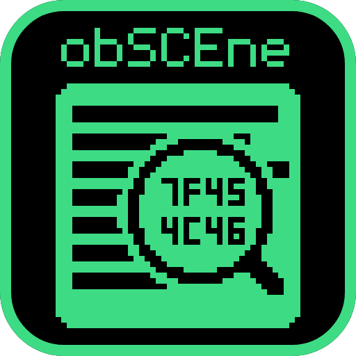

<p align="center">
  
</p>

# ob**SCE**ne

A conformance probe for the Prospero-generation platform, in freestanding C.

Site: **[project-oops.github.io/obSCEne](https://project-oops.github.io/obSCEne/)**

The three letters in the middle are the platform's, and the name has always been built
around them. Where the project renders its own name it marks them rather than spelling the
vendor out: magenta on the screen and in `obscene-tool pretty`, bold here.

It calls the system functions a title would call, one at a time, and reports what
each one actually did. Green if it worked, amber if it answered but the answer was
suspect, red if it failed, grey if a prerequisite meant it was never attempted.

> **Status: it runs, on most loaders that try it.** Which ones, and how far each gets, is a
> **generated** table in [docs/COMPATIBILITY.md](docs/COMPATIBILITY.md) - written from the
> reports themselves, so it cannot drift the way this paragraph did. It named the wrong
> loaders in both directions for a while: one that stops early was listed as finishing, and
> one that finishes was listed as drawing nothing.
>
> Its purpose is to be the first thing an emulator tries to run, long before a commercial
> title is realistic.

<!-- obscene:counts -->
**175 checks across 38 sections**, 39538 censused symbols across 372 libraries.

Of those checks, 78 rest on a public specification, 26 on the specification of the system this kernel derives from, 2 on independent implementations that agree, and 68 on this project's own reasoning. **1 have been confirmed on real hardware**, which is the number that limits what any of this can claim.
<!-- /obscene:counts -->

## Why this exists

An emulator that cannot run anything has no feedback loop. A commercial title is a
terrible first target: it imports thousands of functions, fails opaquely, and tells
you nothing about *which* of them was wrong. This is the opposite - a small program
that exercises one function per check and says exactly what it saw.

It is ordinary homebrew, and it would run on real hardware. That independence is the
point: a probe that only works inside one emulator measures that emulator's opinion of
itself.

**Three accommodations are emulator-specific, and it is worth naming them rather than
claiming none are.** The build-time `EXCLUDE` list names checks known to end the process
on a particular loader; `GEN=4` builds a module marked for the previous generation,
because a previous-generation emulator refuses one marked for the current;
and `puts` is tried before `write` because one emulator accepts written bytes and
discards them. Each is argued where it appears. None changes what a check asks the
platform.

## Building

**The recommended way in is [OOPS](https://github.com/project-oops/OOPS)**, which holds all four
side by side and carries one entry point over them:

```bash
./bin/oops check obscene      # also: build, test, pkg
```

That relays to this repository's own entry point rather than reimplementing anything, so the
two cannot disagree - and it is what CI runs, for the same reason. It also handles the Windows
case: obSCEne needs `clang` and `lld`, and `oops` re-enters through WSL rather than failing
with a compiler error that reads as a code fault.
[docs/BUILDING.md](https://github.com/project-oops/OOPS/blob/main/docs/BUILDING.md) has every verb.

**From inside this repository the entry point is `bin/obscene`**, carrying the same verbs:

```bash
./bin/obscene build   # module, payload, injector, host
./bin/obscene check   # all of the above plus verification. What CI runs.
./bin/obscene pkg     # the installable package
```

It is a front door rather than an implementation, so any make target still works by name -
`./bin/obscene eboot`, `./bin/obscene module-min`, `./bin/obscene payload HARDWARE=1`.

**[docs/BUILDING.md](docs/BUILDING.md)** is the full account - every verb, the make variables
and the one combination that is refused, which shape reaches which loader, and
what each CI job establishes.

**obSCEne does not build from a clone of only this repository.** It resolves SELFish and
Prosperous by relative path, as siblings, so the layout is a build requirement rather than a
convenience. `oops bootstrap obscene` fetches them.

**Compiling the C needs only clang.** A conformance probe that needs a vendor toolchain to
build is a probe most people cannot run.

Producing a *format* - the module, the eboot, the package - goes through
**[SELFish](https://github.com/project-oops/SELFish)**, which owns every platform file format.
That is not a convenience: it is why a wrong magic or a stale tag cannot be introduced here
in isolation. A checkout without it beside this one builds `host` and nothing the hardware or an
emulator loads.

The host build matters more than it looks. It runs the harness on an ordinary machine
against stubs that fail everything, so the framework is verifiable *before* any
emulator can load it. Without it, the first run happens inside something that does not
work yet, and a bug in the probe is indistinguishable from a bug in the thing being
measured.

## How it works

The design - what it announces before acting, why it is written from the failure side, how the
sections are ordered, what it refuses to invent - is in
**[docs/DESIGN.md](docs/DESIGN.md)**.

## Licence

MIT or Apache-2.0, at your option.

## Where to start reading

- **`docs/WORKFLOW.md`** - how the whole loop works, in plain language: where hashing,
  encoding, decoding and cracking each fit, which commands a person runs by hand, and
  which run themselves. Start here if any of those four words sound like the same thing.
- `docs/LOADING.md` - what a loader has to get right, written from the module
  side after getting one to load.
- `docs/OUTPUT.md` - the report format, which is a contract.
- `docs/DECISIONS.md` - every non-obvious choice and why, including the ones that were
  made, reversed on evidence, and remade.

## Part of OOPS

obSCEne is one of four projects aimed at the same platform's operating system. They are developed
together in **[OOPS](https://github.com/project-oops/OOPS)** and released separately.

| | |
|---|---|
| **[Orbistoun](https://github.com/project-oops/Orbistoun)** | the emulator - attempts to reimplement what a title runs on |
| **[Prosperous](https://github.com/project-oops/Prosperous)** | the instrument - remote management for anything that runs Orbis software |
| **[SELFish](https://github.com/project-oops/SELFish)** | the formats - read, write and build tools for the platform's own file formats |

**Developing any of them?** Clone [OOPS](https://github.com/project-oops/OOPS) - it holds all four side by side, arranged so
they build against each other. Cloning this repository alone gets you this project; it is
the right thing for using it and the wrong thing for changing it.

Shared rules - provenance, naming, decision logs, worklogs, gates - live in
[the OOPS conventions](https://github.com/project-oops/OOPS/blob/main/docs/CONVENTIONS.md) and are not restated here.
