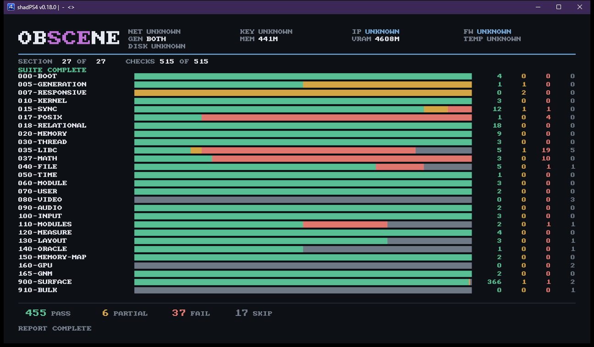
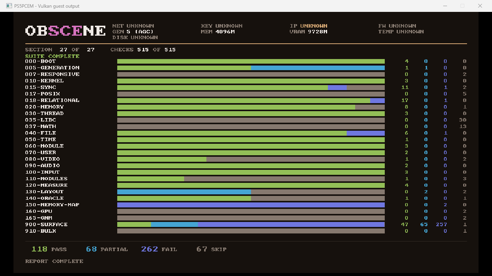
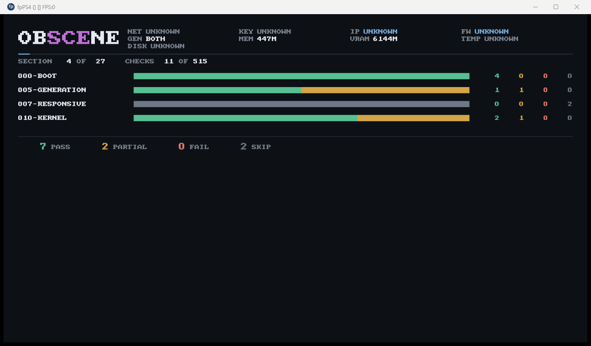
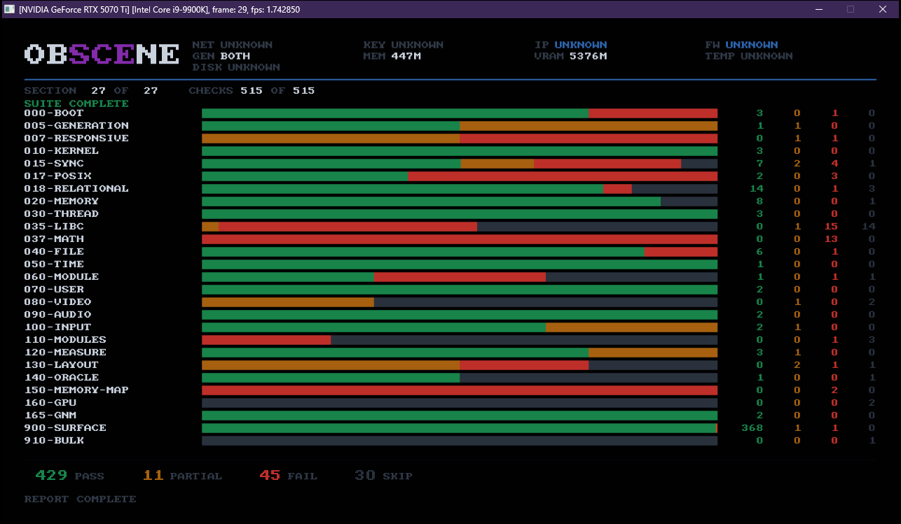

# What each loader does with obSCEne

Results, per loader, from the reports themselves. `docs/EMULATORS.md` says what each loader
*is* and how to run it; this says what happened.

**The table is generated** by `obscene-tool compat`, and `verify.sh` fails if it has drifted
from the reports it was built from. A hand-written results table would be stale within a
day - this project has measured what that costs (D069).

## Results

<!-- obscene:compat -->
| | host | shadPS4 | PS5PCEM | fpPS4 | kyty | orbistoun |
|---|---|---|---|---|---|---|
| Records | 36559 | 36575 | 36432 | 194 | 36520 | 36549 |
| Ran to the end | yes | yes | yes | **no** | yes | yes |
| Output channel | host | sceKernelWrite | write | - | puts | sceKernelWrite |
| Pass / partial / fail / skip | 116/15/358/26 | 456/7/37/15 | 118/68/262/67 | - | 429/11/45/30 | 416/16/56/27 |
| Excluded to keep the loader alive | 0 | 0 | 0 | 0 | 0 | 0 |
| Skipped after dying on a previous run | 0 | **4** | 0 | **19** | **11** | **3** |
| Capabilities established | 7 | 9 | 8 | - | 7 | 6 |
| Checks blocked behind a missing one | **3** | **3** | **0** | - | **12** | **3** |
| Deepest wholly-green section | 20 | 25 | 20 | - | 25 | 4 |
| Census present / absent | 826 / 34505 | 35330 / 0 **(void)** | 3732 / 31598 | 0 / 0 | 35330 / 0 **(void)** | 35330 / 0 **(void)** |
| Probed functions responding / silent | 54 / 0 | 22 / 32 | 0 / 0 | 0 / 0 | 26 / 28 | 31 / 23 |
| Died in | `900-surface/control` | `000-boot/number-formatting` | `000-boot/number-formatting` | `000-boot/number-formatting` | `000-boot/number-formatting` | `000-boot/number-formatting` |

Sections the loaders do not agree on, pass/partial/fail/skip:

| Section | host | shadPS4 | PS5PCEM | fpPS4 | kyty | orbistoun |
|---|---|---|---|---|---|---|
| `000-boot` | 4/0/0/0 | 4/0/0/0 | 4/0/0/0 | 4/0/0/0 | 3/0/1/0 | 2/2/0/0 |
| `005-generation` | 0/1/0/1 | 1/1/0/0 | 1/1/0/0 | 1/1/0/0 | 1/1/0/0 | 1/1/0/0 |
| `007-responsive` | 2/0/0/0 | 0/2/0/0 | 0/0/0/2 | 0/0/0/2 | 0/1/1/0 | 0/2/0/0 |
| `010-kernel` | 3/0/0/0 | 3/0/0/0 | 3/0/0/0 | 2/1/0/0 | 3/0/0/0 | 3/0/0/0 |
| `015-sync` | 11/1/0/2 | 12/1/1/0 | 11/0/1/2 | 12/0/1/1 | 7/2/4/1 | 5/0/7/2 |
| `017-posix` | 4/0/0/1 | 1/0/4/0 | 0/0/0/5 | 0/0/0/5 | 2/0/3/0 | 0/0/4/1 |
| `018-relational` | 18/0/0/0 | 18/0/0/0 | 17/0/1/0 | 16/0/1/1 | 14/0/1/3 | 8/0/2/8 |
| `020-memory` | 4/0/1/4 | 9/0/0/0 | 8/0/0/1 | 9/0/0/0 | 8/0/0/1 | 2/0/3/4 |
| `030-thread` | 3/0/0/0 | 3/0/0/0 | 3/0/0/0 | 3/0/0/0 | 3/0/0/0 | 2/1/0/0 |
| `035-libc` | 30/0/0/0 | 5/1/19/5 | 0/0/0/30 | - | 0/1/15/14 | 10/1/16/3 |
| `037-math` | 13/0/0/0 | 3/0/10/0 | 0/0/0/13 | - | 0/0/13/0 | 0/0/13/0 |
| `040-file` | 5/0/0/2 | 5/0/1/1 | 6/0/1/0 | - | 6/0/1/0 | 2/2/3/0 |
| `050-time` | 1/0/0/0 | 1/0/0/0 | 1/0/0/0 | - | 1/0/0/0 | 0/0/1/0 |
| `060-module` | 3/0/0/0 | 3/0/0/0 | 3/0/0/0 | - | 1/0/1/1 | 2/0/1/0 |
| `070-user` | 0/0/2/0 | 2/0/0/0 | 2/0/0/0 | - | 2/0/0/0 | 0/0/2/0 |
| `080-video` | 1/0/0/2 | 0/0/0/3 | 1/0/0/2 | - | 0/1/0/2 | 2/0/0/1 |
| `090-audio` | 1/1/0/0 | 2/0/0/0 | 2/0/0/0 | - | 2/0/0/0 | 1/1/0/0 |
| `100-input` | 1/1/0/1 | 3/0/0/0 | 3/0/0/0 | - | 2/1/0/0 | 1/1/0/1 |
| `110-modules` | 1/0/0/3 | 2/0/1/1 | 1/0/0/3 | - | 0/0/1/3 | 1/1/1/1 |
| `120-measure` | 4/0/0/0 | 3/1/0/0 | 4/0/0/0 | - | 3/1/0/0 | 1/1/2/0 |
| `130-layout` | 3/0/0/1 | 3/0/0/1 | 0/2/0/2 | - | 0/2/1/1 | 2/1/0/1 |
| `150-memory-map` | 1/1/0/0 | 2/0/0/0 | 0/0/2/0 | - | 0/0/2/0 | 1/0/0/1 |
| `165-gnm` | 0/0/0/2 | 2/0/0/0 | 0/0/0/2 | - | 2/0/0/0 | 1/1/0/0 |
| `900-surface` | 2/10/355/3 | 368/1/1/0 | 47/65/257/1 | - | 368/1/1/0 | 368/1/1/0 |
<!-- /obscene:compat -->

## Real hardware is the source of truth, not a column here

There is deliberately no hardware column in the table above. A retail PS5 is not a loader being
compared - it is the thing every loader in that table is scaffolding *toward*, and obSCEne has run
on one. Its results have their own document, cited record by record:

**→ [`docs/HARDWARE.md`](HARDWARE.md) - what a real PS5 answered.** The full account: which
libraries the console maps and binds, which failures are the platform's and which are the module's,
the video-out alignment finding, the media-codec loads that take the process down, and the two
committed runs behind it - `data/hardware/ps5-full.txt` (before imports bound) and
`data/hardware/ps5-imports.txt` (after).


The suite runs to completion on the console and draws its own report to the screen. Most of the red
is one thing - libraries the console will not load for a title of this category - which is a finding
about the platform, not a defect in obSCEne; HARDWARE.md separates the two. The numbers are not
repeated here on purpose: this is a **measurement**, and pasting it beside a table regenerated from
emulator reports and gated against drift (D069) is precisely the hand-maintained staleness this
document quarantines patched-loader results for. `./bin/obscene report` and `./bin/obscene deploy`
capture a fresh run off the console; read the standing ones where they are cited.

## What these results are for, and what they are not

**These loaders are scaffolding, not the standard.** They exist here to get obSCEne running
before hardware is available, and to give the report something to be checked against while it
has nothing else. The source of truth is real hardware; the direction of travel is that
obSCEne and its sibling become the reference *these* loaders are measured against, not the
other way round.

That matters for how a failure in this table should be read. A loader that cannot run
obSCEne is not automatically evidence that obSCEne is malformed, and the current shadPS4 is
the case that makes the distinction concrete.

### Current shadPS4 refuses to load the corpus build, and that is a firmware gap

Built from its own source (`be21649`), shadPS4 stops in the loader:

```
LoadModule: Provided file /app0/sce_module/libc.prx does not exist
preloadModulesForLibkernel: Assertion Failed!
libc.prx cannot be loaded, but the guest attempted to use it.
```

obSCEne declares the platform libraries it works with in `DT_NEEDED`, which is what the tag
is for and what a real title does. **On the hardware those modules exist** - `libc`, `libSceFios2`
and the rest ship with the firmware, the loader loads them, and nothing here fires.

shadPS4 has no firmware to load, because this toolkit is deliberately firmwareless. Faced
with a declared dependency it cannot satisfy, it now asserts. The binary this project
measured with previously printed `Failed to preload libc, expect crashes` and carried on -
same module, 65,665 log lines against 33,044, and a run that reached `040-file` instead of
dying at load.

So the change is in the emulator's tolerance, not in obSCEne's correctness. What obSCEne asks
for is what the hardware provides; a loader without the hardware's libraries is entitled to say
so, and choosing to make it fatal is its call rather than a defect being reported here. The
module is unchanged and still loads on the older binary, on fpPS4, and on PS5PCEM.

**One thing genuinely open on our side.** The corpus spans 23 firmware versions and no single
hardware carries every library in it, so a large set of hard dependencies is not obviously
right for hardware either - for a different reason than the one above. The durable answer is
probably not `DT_NEEDED` at all: `sceKernelLoadStartModule` and `sceKernelDlsym` would let the
census ask the platform at runtime and read its error code, which is stronger evidence than a
resolved address on a loader that stubs whatever it cannot find (D140). Tracked in D149.

## How to read it, and how not to

**This is not a ranking.** A pass count is not a quality score:

- a loader that resolves every import to a generic stub scores well on *presence* and badly
  on *behaviour* - shadPS4 reports all 87 current-generation graphics symbols present for
  an interface it does not implement at all;
- a loader that resolves only what it implements scores nothing on presence while being the
  most honest of the group;
- and a loader that refuses to run scores nothing at all while telling you something true
  about your module.

**A census marked `(void)` is not a small number written oddly.** `900-surface/control`
probes one symbol that must resolve and one that cannot exist. A loader that stub-resolves
everything answers "present" to the impossible one, the control fails, and in its own words
*every count in that section is meaningless*. shadPS4 and fpPS4 both fail it, so their
35,337-of-35,337 and 376-of-376 are not measurements of a platform - they are measurements of
a loader that says yes to anything. The numbers are shown rather than hidden, and marked,
because the comparison a reader would otherwise make is against PS5PCEM's 3,736, which *was*
measured.

This is the table catching itself. The control's verdict was in every report all along and
the table ignored it, presenting a void count beside a real one with nothing to separate them.

**The number worth steering by is "checks blocked behind a missing one."** It counts the
suite sitting behind the floor, and unlike a pass count it cannot be moved by resolving more
symbols. See D067.

**Per-section tallies are kept rather than merged**, because "fails everything in one
section" and "fails one check in each of eight" are different platforms and a total hides
which.


## Presence versus behaviour, measured

Everything above argues that a pass count is not a quality score because a stub-everything
loader scores well on presence. That was an argument. On 2026-08-24 it became a measurement.

`910-bulk` calls **every** censused symbol with nothing in its arguments and records what
came back. Against shadPS4 it reached the end of the list - 32,466 entries, 26 rounds on the
final pass, resuming across four sessions:

| | |
|---|---|
| answered | **32,275** |
| returned `zero` | **31,111 - 96.4%** |
| `error-shaped` | 961 |
| `rejected` | 125 |
| `value` | 78 |
| never returned | 191 |

The same loader's address census reports roughly 35,000 of 35,000 symbols present.

### Why 96.4% zero is damning rather than ambiguous

Every call passes nothing - all arguments zero. A function taking an out-pointer **cannot**
succeed on a null one; a function taking a handle cannot operate on handle zero. The correct
answer for the overwhelming majority of these calls is a refusal, and refusing is precisely
what a generic stub cannot do, because it does not know what it is standing in for.

So the zero rate is not "these calls happened to work". It is the shape of a loader that
resolves an import to a function returning success and nothing else.

### The useful half is the inverse

**A high refusal rate means argument validation is running.** These are the libraries where
matching the loader's behaviour means matching something:

| library | refused / answered |
|---|---|
| `libScePlayGo` | 13 / 13 |
| `libSceImeDialog` | 13 / 13 |
| `libSceNpTus` | 134 / 141 |
| `libSceRtc` | 41 / 44 |
| `libSceNpAuth` | 12 / 13 |
| `libSceNpSignaling` | 22 / 24 |
| `libSceGnmDriver` | 143 / 229 |
| `libkernel` | 49 / 83 |

And the other end, which is the number worth quoting:

**282 of 342 libraries answered only zero - every symbol, 24,532 of them, accepting anything
and reporting success.** Not one call in any of those libraries was refused. `libSceNet`
answered 197 calls and objected to 18; the six `libSceAbstract*` libraries answered 485
between them and objected to none.

### What it does not say

**It is one loader.** A different one would produce a different table and none of it is a
hardware measurement - **this behavioural map has never run on hardware**, even though the suite
itself has (see *Real hardware is the source of truth* above). The presence-versus-behaviour
argument is confirmed on shadPS4 alone.

**A zero is not proof of a stub.** Some functions genuinely succeed on zero arguments, and
`docs/OUTPUT.md` is explicit that this bucket cannot separate the two. The argument rests on
the *proportion*, not on any individual record.

**It is not a defect report.** A loader that stubs a library nobody has asked it to implement
is doing the reasonable thing. The value here is a map of where an emulator has something to
get wrong, which is a much smaller surface than the census implies - and the census is what a
coverage number would be computed from.

## Screenshots

obSCEne draws its report to the screen, which exists for the case where no text channel
works. Most captures are the summary page, which answers "what happened" on its own.

**All five loaders render the report.** Kyty was the last holdout and needed a fix inside its
own memory tracking rather than anything in this module - see the Kyty section below.

Capturing these needs more than a screen grab, and the reason is worth knowing before trusting
one. `PrintWindow` asks a window to render itself, so it works when the window is behind
something or was never shown at all - and `PW_RENDERFULLCONTENT` is required for anything
drawing through a GPU compositor, which all of these do. Without it the capture is a blank
rectangle of the right size, which is a convincing-looking wrong answer.

The window is also not always the one Windows will hand you. `MainWindowHandle` reports the
first top-level window created by a process's *main* thread, and a loader that opens its
window from a render thread has a perfectly good window and a handle of zero. Kyty's is also
marked not-visible. `screenshot.sh` therefore enumerates top-level windows by owning process
id, prefers a visible one, and falls back to any window larger than 64x64.

The fpPS4 one is a detail page instead, and was not chosen: once the report is complete the
presenter cycles, so what a capture lands on depends on when the run finished. It is kept
because it happens to show the thing that section is about - individual `035-libc` checks
passing and failing side by side - which the summary would have reduced to one bar.

### shadPS4 - previous generation



27 of 27 sections, **515 of 515 checks, `SUITE COMPLETE`**. 455 pass, 6 partial, 37 fail,
17 skip.

Note `900-SURFACE` at 368 green: shadPS4 resolves nearly every censused symbol, including
libraries it does not implement. That row is the stub behaviour of D130 rendered as a bar.

### PS5PCEM - current generation



26 of 26 sections, **499 of 499 checks, `REPORT COMPLETE`**, and the header reads
`GEN 5 (agc)` - the first current-generation run this project has produced.

The same source and the same binary logic as the shadPS4 capture above. The display works
on both because it takes whichever video-out pair the platform actually has, preferring the
older when both appear present (D111, D140).

`900-SURFACE` is the opposite shape here - mostly red, because PS5PCEM resolves what it
implements and nothing else.

### fpPS4 - previous generation



26 of 26 sections, **148 of 148 checks, `REPORT COMPLETE`** - 81 pass, 7 partial, 5 fail,
55 skip. `CORPUS=0`, because each round of the sweep that got here is a full run.

**Reaching the end took 44 exclusions**, found one at a time over 35 sweep rounds. The first
run stopped at 33 records, and the walk that followed is the most detailed picture this
project has of a loader: `007-responsive/libc` (`strspn`), `007-responsive/math`,
`015-sync/machine-kind`, five of `017-posix`, twenty-two of `035-libc`, all thirteen of
`037-math`, and `010-kernel/is-stack`. Each was confirmed a hang rather than a slow check by
re-running at double the budget and getting the identical stopping point (D144).

**The libc picture is mixed, and that is the interesting part.** Eight of the thirty
`035-libc` checks run to completion - the screenshot above catches three of them:
`malloc-free`, `calloc-zeroes` and `realloc-preserves` green, `strncpy-padding` and `strstr`
amber, the rest skipped. So allocation works and most string handling does not return.
`037-math` has no survivors at all: thirteen of thirteen hang.

That contrast is why the exclusion list names twenty-two `035-libc` checks individually
instead of the section (D145). A section entry would have been right for `037-math` and would
have reported eight working checks as fatal here.

The header now reads `GEN UNKNOWN`. It used to read `GEN 5 (CURRENT)` for a module built
`GEN=4`, which was a finding rather than a bug - fpPS4 installs a logging stub for every
import it cannot resolve, so the current-generation graphics symbols resolve too - and D140
is the correction: when both generations appear present, presence proves nothing, and
`unknown` is what the header is entitled to say.

### Kyty - silent, then fixed

**This section describes a state Kyty is no longer in.** The generated table above has it
running to the end and reporting through `puts`; the fix was inside Kyty's own memory
tracking rather than anything here. What follows is kept because the diagnosis is the useful
part and it was right - two independent causes, both design choices - and because a reader
meeting the same silence elsewhere will want it.



At the time: a black window whose title bar read `frame: 3062, fps: 59.98`. Alive, presenting at full
rate, and the guest had drawn nothing into it. That distinguished two things a blank capture
otherwise cannot: the loader was not hung, and obSCEne's drawing never reached the screen.

**And the silence is structural, not a missing flag** (D080). Kyty's `sceKernelWrite` is a
filesystem call that requires an opened file, so descriptor 1 returns `EPERM`; the `puts`
fallback would work, but Kyty registers it under the library `LibcInternal` while this module
imports it from `libSceLibcInternal`, so it never resolves. Two independent causes, both
design choices rather than defects, and closed as not worth a per-loader accommodation in the
import table.

**What it is uniquely good for.** Kyty names every import it cannot resolve, which a
stub-everything loader never does. Against the current module that is **252 named missing
functions** out of 34,213 imports, including twelve `sceAgc*` entry points - a list shadPS4
cannot produce at all.

### orbistoun - runs the whole suite, and cannot be photographed

The first current-generation loader here that is not an emulator project at arm's length: it
is the sibling project this one exchanges findings with.

**It completes the suite.** 36,549 records, 27 of 27 sections, 515 of 515 checks, in about two
seconds - 416 pass, 16 partial, 56 fail, 27 skip. This section previously read *"parses, maps,
halts before imports"*, which was true on 2026-08-25 in the morning and false by the evening;
the generated table above had moved and the prose had not. That is the exact failure this
project keeps cataloguing, committed here.

**There is no screenshot, and the reason is one function.** obSCEne opens its display against a
user, exactly as `080-video` does, and orbistoun answers both user-service calls with its
Unimplemented placeholder:

```text
070-user/initialise    fail  0x7fff0001  the user service refused to initialise
070-user/initial-user  fail  0x7fff0001  no initial user could be determined
OBS|display|absent|no initial user, even after initialising the service
```

`0x7fff0001` carries no high bit, deliberately, so it can never be mistaken for a value the
platform returned - the loader is saying *not implemented* rather than *refused*. obSCEne then
declines to open an output, which is correct: there is nobody to open one for. Everything after
that is unaffected, which is why the report is complete while the window is empty.

So the whole distance between orbistoun and a picture is `sceUserServiceInitialize` and
`sceUserServiceGetInitialUser`.

**And the three loaders that do implement it disagree about the answer:**

| loader | initial user |
|---|---|
| shadPS4 | `0x3e8` |
| PS5PCEM | `0x10000000` |
| Kyty | `0x1` |

No two agree, so what real hardware returns is unknown, and an implementation copying any one
of them is copying a guess. See `docs/BOOT.md` for the related question of which user id
`sceVideoOutOpen` will accept, where Kyty contradicts *itself*.

## Regenerating

**Each loader gets its own build directory, and that is not tidiness.** The exclusion list
lives beside the module, and it is *per loader*: shadPS4's crashes are not fpPS4's. While one
directory was shared, a sweep inherited whatever the previous loader had left there - shadPS4
was running with four exclusions when it needs **two**, and at one point with fpPS4's
forty-four. A second route made it worse: `bulk-sweep.sh` writes exclusions meaning "this
check blocked the prober" into the same file that `sweep.sh` fills with "this check crashes",
and neither script could tell them apart afterwards.

```bash
# One directory per loader. --resume keeps a list already established.
sh scripts/sweep.sh --build /tmp/obs-shad --generation 4 \
    --emulator <emulators>/shadps4/shadPS4.exe --out reports/shadps4.txt
sh scripts/sweep.sh --build /tmp/obs-fp --resume --generation 4 \
    --emulator <emulators>/src/fpPS4/fpPS4.exe --out reports/fpps4.txt

# Loaders needing no exclusion walk run directly against a built module.
VM_MODULE=/tmp/obs-orb/obscene.module.elf sh scripts/run-emulator.sh \
    --emulator <emulators>/src/PS5PCEM/zig-out/bin/game-run.exe --out reports/ps5pcem.txt
VM_MODULE=/tmp/obs-orb/obscene.module.elf sh scripts/run-emulator.sh \
    --emulator <OOPS>/orbistoun/target/release/orbistoun-cli.exe --out reports/orbistoun.txt

# Kyty has its own runner: the report cannot arrive (D080), the unresolved list can.
VM_MODULE=/tmp/obs-orb/obscene.module.elf sh scripts/run-kyty.sh --out reports/kyty.txt
cd tool && cargo run --quiet -- unresolved --root .. /tmp/obscene-kyty/_kyty.txt

cd tool && cargo run --quiet -- compat --into ../docs/COMPATIBILITY.md --write \
    "host=../reports/host.txt" "shadPS4=../reports/shadps4.txt" \
    "PS5PCEM=../reports/ps5pcem.txt" "fpPS4=../reports/fpps4.txt" \
    "kyty=../reports/kyty.txt" "orbistoun=../reports/orbistoun.txt"
```

## Kyty runs the whole suite, and now renders it, with local patches

**It renders.** 27 of 27 sections, 515 of 515 checks, `SUITE COMPLETE` on screen. All five
loaders in this toolkit now display obSCEne's report.

What stood in the way was not homebrew, and the question that found it was *"it makes no sense
that Kyty can launch retail games but not our code"*. It does not, and the answer is in
`GpuMemory::Update`: a registered framebuffer is re-read from guest memory only when
`submit_id` advances, and that counts **GPU submissions**. A title rendering through the
graphics driver submits constantly and its buffer is uploaded every frame. obSCEne draws with
the CPU and submits nothing, so the counter never moved, the upload was never reached, and the
image held what it had at creation - nothing.

GPU-written versus CPU-written, not retail versus homebrew. The loader's own `mem_watch` flag
is the intended answer to that case and is hardcoded false. (D188)

The remainder of this section is the state before that was found, kept because the reasoning
about *what a patched loader's numbers are worth* has not changed.

## Kyty runs the whole suite, with local patches

Two facts that have to travel together, because either alone is misleading.

**It completes.** With `patches/kyty-probe-friendly.patch` applied and the runtime resume left
to accumulate across runs, Kyty reaches the end record: **36,524 records, 429 pass / 11 partial
/ 45 fail / 30 skip**, over ten runs of one binary that walk past one blocker each. Stock Kyty
manages **one** record and dies in `puts`. The result lives in `reports/kyty-patched.txt`,
never in `reports/kyty.txt`, and it is a measurement of a build only this machine has.

The three patches, all of them the same shape - an input the loader does not recognise treated
as fatal rather than as an error to return:

| site | upstream | patched |
|---|---|---|
| `Jit::JmpWithIndex` | unresolved import jumps to a handler that calls `EXIT` | `xor eax,eax; ret` |
| `VideoOutOpen` | refuses any user id but `255`/`0`, contradicting its own `GetInitialUser` returning `1` | accepts any |
| `PthreadMutexattrSettype` | `EXIT` on an unrecognised type | returns `EINVAL`, as POSIX specifies |

**It cannot show any of it.** Kyty binds `sceVideoOutOpen` and does *not* bind the three
functions needed to put a frame on screen:

| NID | function | resolves to |
|---|---|---|
| `Up36PTk687E` | `sceVideoOutOpen` | `0x7ff7002ce990` |
| `w3BY+tAEiQY` | `sceVideoOutRegisterBuffers` | **0** |
| `i6-sR91Wt-4` | `sceVideoOutSetBufferAttribute` | **0** |
| `U46NwOiJpys` | `sceVideoOutSubmitFlip` | **0** |

All four are registered by `LIB_FUNC` in the same source file; only the first actually binds.
The window exists at the right size and stays black, so there is nothing to photograph. Every
other loader's screenshot is its report; Kyty's report is text only.

### What the patch costs, which is the part worth carrying elsewhere

Those three unbound functions now hit the trampoline and **return 0**, which obSCEne reads as
success. So it reports `display|ready|1920x1080 framebuffer` for a display that cannot present
a single frame.

That is the patch converting an honest failure into a silent success - the exact failure mode
this program exists to detect, introduced by us, one level below where we were looking. It is
the strongest argument available for why a patched loader's report is quarantined from the
table: the numbers above are real, and the display line in the same report is not.


## fpPS4's column is a truncated run, and now there is a complete one beside it

Two facts that have to travel together, as with Kyty.

**The `fpPS4` column above is 194 records and nine sections, with no end record.** That is not
what fpPS4 can do - it is where the run stopped. Every unresolved function import in fpPS4 is
bound to a handler that calls `Sleep(INFINITE)`, so the first missing function freezes the
calling thread permanently and the process sits there alive and silent. Sections the column
shows as unreached were never attempted, and reading them as absences would be reading a
stalled run as a verdict. (D196)

**With `patches/fpps4-probe-friendly.patch` it completes.** The handler returns zero instead:

| | stock | patched |
|---|---|---|
| records | 36-194, depending on how far resume had walked | **36,631** |
| sections | 9 | **27 of 27** |
| checks | - | **515 of 515**, 448 pass / 11 partial / 45 fail / 11 skip |
| wall clock | ran until killed | **2s** |
| unimplemented imports survived | 0 | **181** |

`reports/fpps4-patched.txt`, and deliberately **not** the column above. The rule is D176's and
it holds here for the same reason it holds for Kyty: the behaviour was changed, so the numbers
describe a build only this machine has.

### Why the stock column is still worth keeping

Because "this loader stops dead on the first unimplemented import" is a real property of the
shipped software, and it is the one an unattended sweep actually meets. The 181 in that table
is what makes the difference concrete: at two runs per blocker under D191, converging the stock
build would take roughly **362 runs** of the same binary. The patched build takes one.
