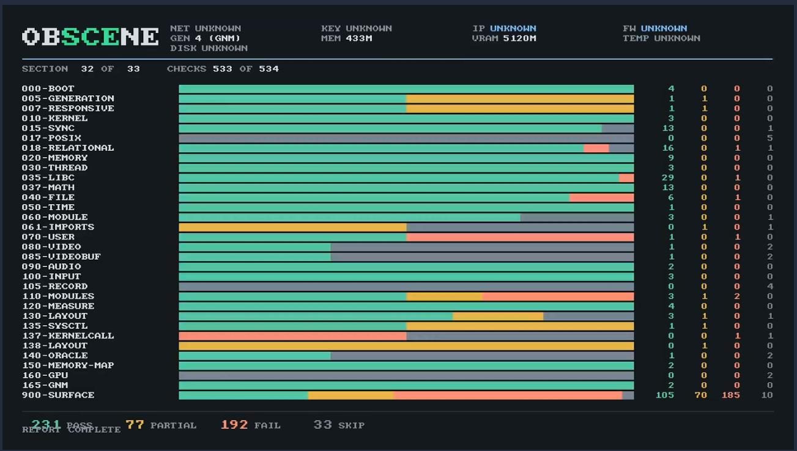

# What a real PS5 answered

Findings from running obSCEne on real hardware, each traceable to a record in
`data/hardware/`. Recorded 2026-08-30, on the first runs this project has ever completed on a
console.

**Every claim here cites a line.** A consumer - orbistoun above all - has to be able to say how
something was determined and have somebody else reach the same answer. Where a finding rests on
inference rather than a record, it says so.

**Not to be confused with [`HARDWARE-PROBE.md`](HARDWARE-PROBE.md)**, which is the orbistoun
side's scoping of *what it would want asked* and was written before any of this ran. That file
is a request; this one is the answer, and the two are worth keeping apart because a wish and a
measurement read identically once they are a fortnight old.

## The shape of the run

The complete suite, census included, from one binary:

```text
OBS|meta|1|30|528          30 sections, 528 checks
OBS|tally|232|75|192|29    pass / partial / fail / skip
obscene: suite complete
```

**499 of 528 checks produced a result.** The 192 failures are almost all one thing - a library
the census could not load - and that is the finding, not a fault.

The first complete run, before the import defect below was found, was
`OBS|tally|218|74|189|40` over 521 checks. Both files are kept:
`data/hardware/ps5-full.txt` is that run, `data/hardware/ps5-imports.txt` is the one that
carries `import` records. Each names the build that produced it.

## The loader maps the libraries, and for a long time did not bind their symbols

**This section previously said the loader mapped five of the twelve libraries the eboot
declares.** That was inferred from which symbols resolved, and it was wrong. The system log
names each library it maps, with an address range and a fingerprint:

```text
# /<sandbox>/common/lib/libScePad.sprx
#  xotext: 0000000800968000:0000000800980000 nsegs: 4
#  fingerprint: c68f5edf5ba4c424ce9468cbc64b016900000000
```

**165 libraries are mapped into the process, and ten of our twelve are among them** - only
`libScePosix` and `libSceVideoRecording` are not. `libScePad` is mapped, at a known address,
and every one of its imports is null.

So mapping and binding are separate, and this project was reading the absence of the second as
the absence of the first.

### Which is our defect and which is the platform's

`061-imports` puts the two axes side by side - did the import bind, and does a run-time lookup
find the same name in the same library:

```text
OBS|import|libScePad|scePadOpen|unlinked|resolvable
```

`unlinked` with `resolvable` is the repairable case: the platform has it, and this module
failed to ask for it correctly. **There were fourteen. There are now none.**

### Every import was weak, and the loader took that at its word

This program declares its platform functions weak so an absent one is null rather than a link
error. That binding travelled into the module, and all 203 imports were `STB_WEAK`, undefined -
which to a loader means "if resolving this costs anything, do not bother."

```text
ours   WEAK   FUNC   x203
real   GLOBAL FUNC   x126   GLOBAL OBJECT x13      (a title that launches: no weak imports)
```

`libkernel` and `libSceLibcInternal` bound because they are already resident and resolving
against them is free. Every other library was mapped - address range and fingerprint in the log
- and left unbound.

Re-binding imports as `STB_GLOBAL` when the module is built fixed it. Same console, one flag:

| | before | after |
|---|---|---|
| imports bound | 127 | **141** |
| the platform has it and we did not bind it | **14** | **0** |
| the platform does not offer it | 6 | 6 |
| checks skipped for an unresolved symbol | 24 | **10** |
| tally | 220/75/192/41 | **232/75/192/29** |

`100-input`, `090-audio` and `165-gnm` pass outright. `080-video`, `070-user` and `130-layout`
run and report for the first time - and found three things no run had ever reached:

```text
070-user/initialise            0x80960003  the user service refused to initialise
080-video/open                 0x80290009  the main video output would not open
130-layout/query-size-ladder               every size accepted, so the size is not validated
```

Six imports remain unbound, and none of them is repairable here.

`sceKernelIsCex` is absent from a library that binds 84 other symbols, so it is simply not
offered. The other five are `libScePosix` names - `posix_getpagesize`, `posix_sigemptyset`,
`posix_usleep`, `posix_pthread_rwlock_init`, `posix_pthread_rwlock_tryrdlock` - and the reason
is one level up from the names:

```text
OBS|res|900-surface/posix|fail||this library could not be loaded
```

**`libScePosix` does not load at all.** It is one of the two declared libraries the loader never
mapped, and the census cannot reach it either. The shared `posix_` prefix on all five is
therefore not evidence about the spelling: nothing in that library resolves under any name, so
the names are untested rather than wrong.

Three candidates were eliminated on the way, each against the oracle or the console - the
import-library attribute (`0x1` where a real title writes `0x9`; genuinely wrong, now fixed,
changed nothing), `sdk_version` (no effect on binding, and it stops `sceKernelDlsym` answering
entirely - D244), and `.prx` versus `.sprx` filenames (a real title writes `.prx` too).

All three were fields somebody had chosen. The answer was in one nobody chose. (D248)

### A run-time load does not repair it

```text
OBS|res|060-module/runtime-load-binds-imports|fail||loading the library at run time does not
bind an import the loader left unresolved
```

`libScePad` loaded, `sceKernelDlsym` returned `scePadOpen`, `&scePadOpen` stayed null in the
same process. So "load everything at startup" is not the repair, and a check that needs an
unbound symbol has to reach it through a resolved pointer. (D239)

## What the census measured

| | |
|---|---|
| symbols confirmed present | **10,243** |
| symbols confirmed absent | 3,188 |
| libraries fully present | 105 |
| libraries partly present | 70 |
| libraries a title cannot load | 180 |

About a third of the 35,518-symbol corpus gets a verdict. The remainder sits inside libraries a
title cannot reach at all, which bounds what an emulator needs to implement for a title of this
shape.

## Loading a media codec library kills the process

Isolated one at a time by the iterative sweep (`./bin/obscene hwsweep`), each identified by a
`try` record with no matching `res` - which is what announce-before-attempting is for:

```text
libSceM4aacEnc   libSceOpusCeltDec  libSceOpusCeltEnc  libSceOpusDec  libSceOpusSilkEnc
libSceSrcUtl     libSceUlt          libSceVideoCoreServerInterface
libSceVideoOutSecondary             libSceVideoRecording
```

Audio and video codecs and media-server interfaces, without exception across the whole corpus.
`sceKernelLoadStartModule` on any of them ends the process rather than returning an error. Ten
is the complete list: with these excluded the suite runs to the end, so nothing else in the
370-library corpus does it.

## Behavioural failures

```text
018-relational/handle-fits-its-out-parameter  the call wrote past the end of the int it was given
035-libc/wide-strings                          wcslen counted the wrong number of wide characters
010-kernel/is-stack                            a stack address and a static one were reported alike
110-modules/names            0x80020016        the platform would not describe any module
```

**Three more became visible only once imports bound** (D248). No run had ever reached them,
because the symbol they need was null and the check skipped:

```text
070-user/initialise          0x80960003        the user service refused to initialise
080-video/open               0x80290009        the main video output would not open
130-layout/query-size-ladder                   every size accepted, so the size is not validated
```

`080-video/open` is the one to start from for anything wanting a picture on screen: the output
does not open, and the code is the platform's own rather than a guess.

`is-stack` fails identically on PS5PCEM, so it is a genuine console behaviour rather than an
emulator gap - worth stating because orbistoun fixed its own `sceKernelIsStack` on the strength
of the emulator result alone.

## A `ps4_game` title cannot load current-generation libraries

```text
### ERROR: ABIVERSION mismatch. /<sandbox>/common/lib/libSceAgcDriver.sprx
[rtld] ERROR self_load_shared_object:2826: B: res 0 (libSceAgcDriver.sprx)  val 2
```

`val 2` is the library's `EI_ABIVERSION`; the eboot's is 0. **This is not a defect in the
build**: a real launching homebrew eboot is also `EI_ABIVERSION 0`, measured directly from its
container. A title of this category genuinely cannot be given the current generation's graphics
libraries.

**The path forward is native process injection.** Running `./bin/obscene inject` deploys
`obscene-injector.elf` to hijack a running native PS5 retail title, running obSCEne inside
`payload/ps5-native` mode where `libSceAgc` and native Prospero APIs execute unrestricted.
See [`docs/INJECTOR.md`](INJECTOR.md) for the complete runbook.

## The screen works, and the answer was an alignment



Photographed through a KVM rather than captured on the console, because nothing in this program
can screenshot itself: the framebuffer is write-only from where the drawing happens, and a
capture path would be a second thing that could be wrong. What is on the glass is the artefact.


obSCEne draws its report on the console's own display:

```text
OBS|display|ready|1920x1080 framebuffer|0x0
OBS|display|presenting|a submitted frame reached the display|0x0
```

`presenting` is measured rather than assumed - the frame counter moved, which is a stronger
statement than the flip having been accepted.

**The defect was the framebuffer's alignment**, three steps earlier than anyone was looking:

```text
onion,0x4000,1     0x80290015
garlic,0x4000,1    0x80290015
garlic,0x10000,1   0x0          accepted
```

`0x4000` is not coarse enough for a scanout buffer; `0x10000` is. Memory type does not matter -
onion and garlic both refuse at `0x4000`.

### Why it hid for so long

`0x80290015` comes back identically whatever else is right or wrong. Every attempt that varied
a *display* argument got the same number and read it as "still wrong somewhere":

```text
baseline        0x80290015
tiling=0        0x80290015
format=0        0x80290003     <- the argument is read, and the baseline value is fine
aspect=1        0x80290008     <- so is this one
720p            0x80290015
pitch=width*4   0x80290015
```

Two codes moving is what proves the attribute is parsed *and* that the baseline passes. That is
what made it possible to stop varying the attribute and go and vary the allocation instead -
which is where the fault was, in an argument to `sceKernelAllocateDirectMemory` rather than to
anything in `libSceVideoOut`. (D253)

Both tables came out of **one run each**, from `085-videobuf`, which varies one argument per
call inside the probe. Doing it by rebuilding costs about five minutes and a healthy console per
guess. (D251)

### Codes established for `libSceVideoOut`

Each of these was produced by a call that differs from a working one in a single known way, so
each is measured rather than looked up:

| code | produced by |
|---|---|
| `0x8029000b` | any call with an invalid handle - two negative checks pass on it |
| `0x80290015` | registering a buffer aligned to `0x4000` |
| `0x80290003` | registering with the pixel format cleared |
| `0x80290008` | registering with a different aspect ratio |
| `0x80290004` | the current generation's `sceVideoOutRegisterBuffers2` with our arguments |
| `0x80290009` | opening an output this process already holds |

The last one is here because this project reported it as *"the main video output would not
open"* - a hardware finding, with provenance, produced entirely by its own leaked handle
(D250). The output opens fine and always did.

## The report exists only while the title does, and only the title could read it

Two separate things, both of which look like a broken retrieval path.

**The mount is torn down when the title exits.** `/download0` appears outside the sandbox at
`/mnt/sandbox/download/<TITLEID>`; listing it during a run shows `obscene-boot.txt` and
`obscene-report.txt`, and a minute after the run the whole path is `No such file or directory`.
Retrieval happens *during* a run or through a channel that leaves the sandbox as it goes - the
system log (D233), which is the second reason that is written unconditionally rather than
chosen between. (D238) In practice you never chase the file: `./bin/obscene report` reads the
records off that log, and `./bin/obscene deploy` captures them across the launch (D269).

**The file was created `0600`.** A title writes it as whatever user the platform runs titles
as; the shell server and the file-transfer server are somebody else, and both got
`Permission denied` on a file they could see in a listing. The mode was chosen by reasoning
about the writer, and the reader is never the writer. It is `0666` now. (D237)

## `/download0` is writable from inside a title

```text
OBS|sink|/download0/obscene-report.txt
```

`/data` is not - it is reachable by an elfldr payload and not by a sandboxed title. The report
sink tries candidates in order and names the one that worked, so this is measured rather than
assumed.

## The console state a run depends on

Not a finding about the platform, but it invalidates every run if it is wrong, and it cost
several hours before it was understood.

`pldmgr` reads `autoload.txt` and loads the payload chain. With `pldmgr` absent, four of six
payloads never load - including `kstuff-lite`, which patches NPDRM for fake licences. The
symptom is that **every fake-licensed package refuses to launch**, and so do retail dumps:

```text
[SceLncService] PrepareProcessLaunchDirCheck()
scePs4AppCategoryGetForTitleId return 3
CheckPrepareProcessLaunchPkgApp() ret = 80a40086
preLaunchCheck: LNC_ISOK::0x80a40086          → CE-105773-3 on screen
```

Nothing about the package is implicated. Check `ps` for `kstuff.elf` before concluding anything
about a launch failure.

## Bundled modules are looked up by name

`/app0/sce_module` must contain modules the system is looking for. A **well-formed** module under
a name a title never bundles produced the same complaint as an empty directory:

```text
# === Lack of a .prx file in /app0/sce_module is detected!!! ===
```

with no `rtld` line naming it, because nothing looked at it. The names that work are the ones a
real package uses - `libc.prx`, `libSceFios2.prx`. A real title also **imports** from `libc`, so
a stub under that name is only safe while nothing in the build imports from it; `sce-module-guard`
enforces that against the eboot's own manifest.
